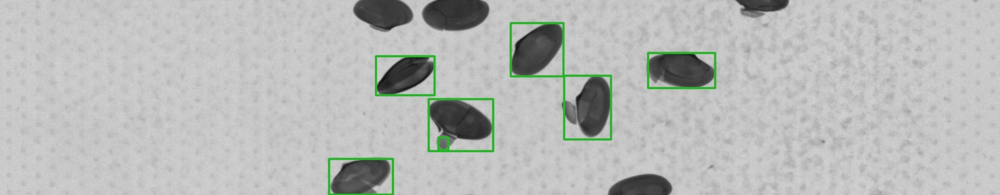
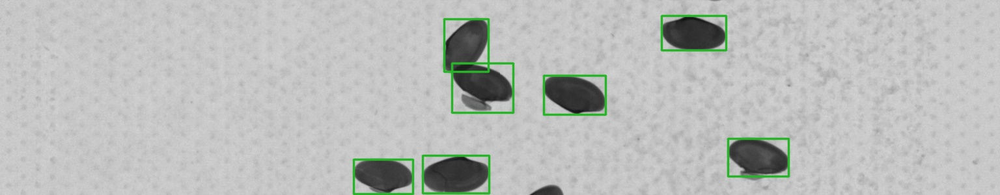
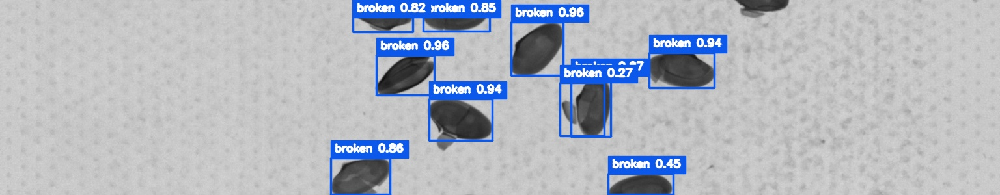
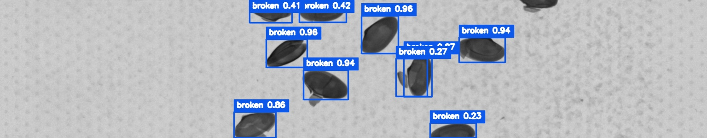
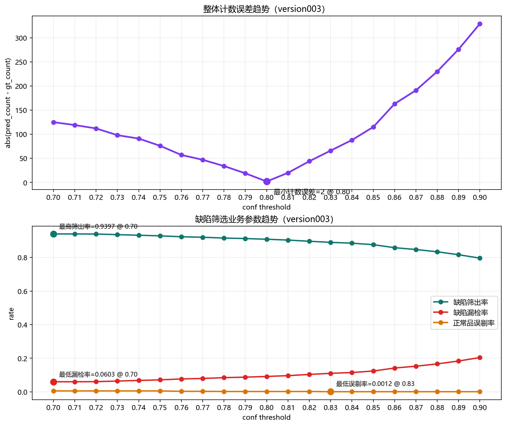
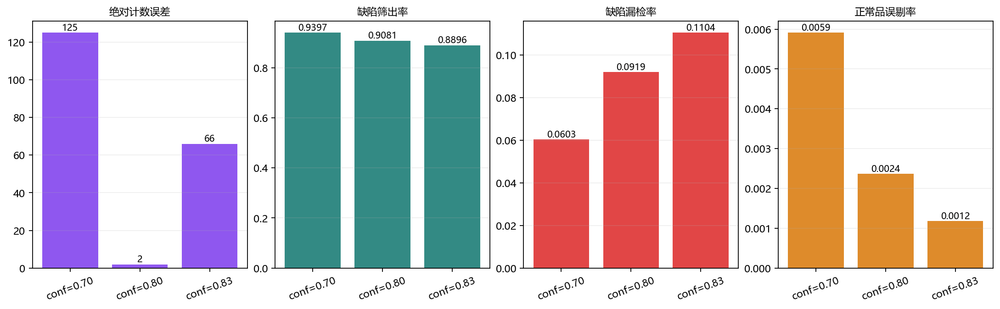
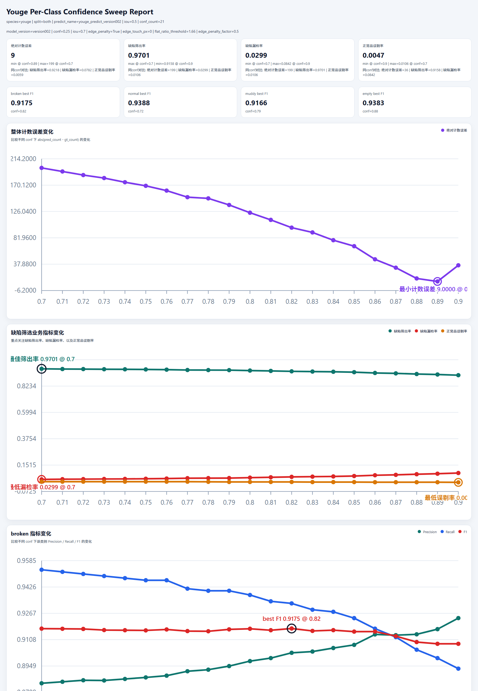
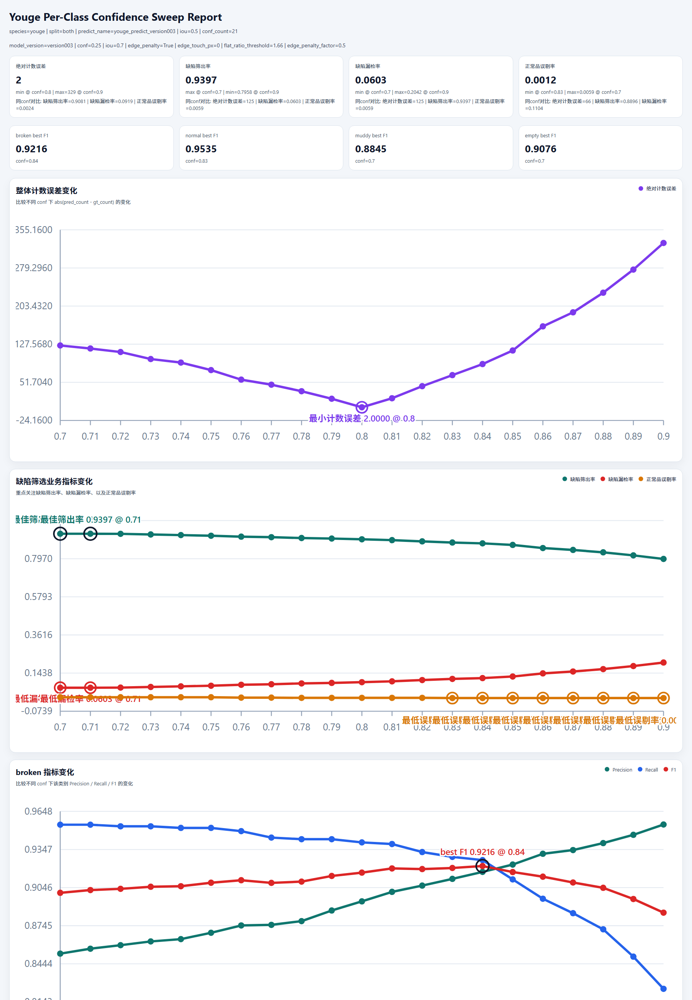
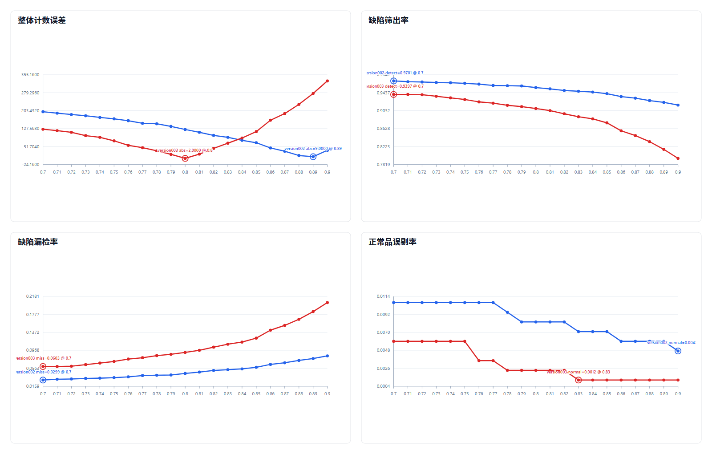
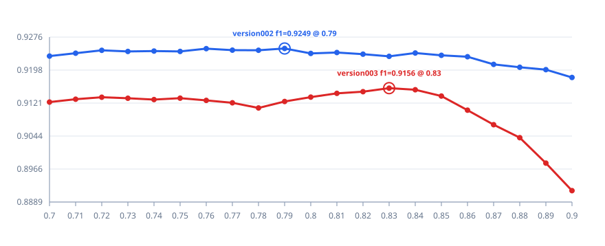

# Youge X-Ray 图像处理核心方案

## 背景

- 当前场景是传送带海鲜的连续 X 光图像检测
- 相邻图片中，同一个海鲜对象可能重复出现，也可能在某一张图中被截断
- 当前图像尺寸常见约为 `1536 × 300`，整体是明显的宽幅图像，宽高比约 `5.12 : 1`

---

## 当前处理的两件事

### 1. 优化标注策略

- 在相邻图片中，优先标注**完整显示**的海鲜对象
- 如果一个对象在当前图中被截断、但在相邻图中更完整，则优先标记更完整的那一张
- 如果相邻图中都完整或都不完整，则折中选择一张进行标注

目的：

- 提高标签质量
- 减少同一对象跨帧重复标注
- 降低截断目标对模型学习效果的干扰

当前未解决问题：

- 对于**纵向排布**的目标，当前这套“优先标注更完整相邻帧”的策略仍然不够稳定
- 实际数据中存在一种情况：同一个纵向目标在相邻两帧中都被截断，无法像横向目标那样稳定找到一张明显更完整的图
- 在这种情况下，即使人工标注阶段做了折中选择，predict 阶段仍可能在相邻帧中重复保留检测结果
- 这会直接影响后续的**严格计数**，目前仍属于未完全解决的问题

示意补充：

- 下图红框区域对应的目标，就是当前这类问题的典型案例
- 在第一张图中，该对象以 `broken 0.77` 被保留
- 在第二张图中，同一个对象又以 `broken 0.86` 被保留
- 这说明它虽然是同一个纵向目标，但在相邻两帧中都被截断、也都被统计标注了
- 该目标在当前帧与相邻帧中都没有完整出现，说明仅靠现有标注优先策略，仍无法彻底消除纵向截断目标带来的重复计数风险

案例示意图：

<table>
  <tr>
    <td align="center" style="font-size: 14px;"><strong>当前帧：broken 0.77</strong></td>
    <td align="center" style="font-size: 14px;"><strong>相邻帧：broken 0.86</strong></td>
  </tr>
  <tr>
    <td></td>
    <td></td>
  </tr>
</table>

对比示意图：

<table>
  <tr>
    <td align="center" style="font-size: 14px;"><strong>当前图片标注情况</strong></td>
    <td align="center" style="font-size: 14px;"><strong>相邻上一张图片标注情况</strong></td>
  </tr>
  <tr>
    <td></td>
    <td></td>
  </tr>
</table>

说明：

- 图中仅保留原始标记框，不包含置信度信息
- 图中靠边缘的横向截断目标没有被标记出来，这正是当前标注策略的一部分
- 当前图上边缘的两个横向贝壳对象，在相邻的上一张图片中已经完成标注
- 实际标注时，优先选择相邻帧中展示更完整的对象进行标记
- 如果当前帧对象被截断，而相邻帧更完整，则优先标记相邻帧中的完整目标

---

### 2. 对横向对象做更严格的规则筛选

- 在 predict 阶段，对**横向排布且异常扁平**的框做更严格处理
- 当框紧贴上边缘或下边缘，并且宽高比异常偏大时，降低其置信度

当前惩罚标准：

- 使用真实像素宽高计算框的宽高比，不直接使用归一化比例
- 只对**紧贴上边缘或下边缘**的框进行判断
- 只重点处理**横向且异常扁平**的框
- 当前版本的典型参数包括：
  - `edge_penalty = true`
  - `edge_touch_px = 0`
  - `flat_ratio_threshold = 1.64`
  - `edge_penalty_factor = 0.5`

当前惩罚方法：

- 如果一个框同时满足：
  - 紧贴上边缘或下边缘
  - 宽高比超过阈值
- 则对该框做降置信度处理：
  - `new_conf = old_conf × edge_penalty_factor`

目的：

- 压制横向截断目标的高置信度输出
- 减少相邻图片间同一对象的重复识别
- 为后续总量计数提供更干净的检测结果

对比示意图：

<table>
  <tr>
    <td align="center" style="font-size: 14px;"><strong>惩罚前</strong></td>
    <td align="center" style="font-size: 14px;"><strong>惩罚后</strong></td>
  </tr>
  <tr>
    <td></td>
    <td></td>
  </tr>
</table>

当前规则示例：

- 当框紧贴上边缘或下边缘
- 且真实像素宽高比超过设定阈值
- 则对该框进行降置信度处理

例如当前图中上方两个横向且贴边的框：

- 惩罚前约为 `0.85`、`0.82`
- 惩罚后约为 `0.42`、`0.41`

这类就是规则命中的典型案例，用于减少重复识别和截断误检。

必要性说明：

- 在模型原始识别结果中，这两个上边缘横向对象仍然会被识别成标准对象
- 如果不额外处理，它们会以较高置信度保留下来
- 加入横向惩罚后，这类框的置信度会明显下降
- 之后就可以通过置信度阈值把这类被截断对象筛掉，从而减少重复识别和后续计数干扰

---

### 3. 通过阈值扫描同时兼顾缺陷筛选与整体计数

- 在 `src/opt-class` 中，对同一版 predict 结果做多组 `conf threshold` 扫描
- 将预测框与原始标记框进行匹配
- 不再只看通用的 `Precision / Recall / F1`
- 当前更重点关注 4 个业务参数：
  - `绝对计数误差`
  - `缺陷筛出率`
  - `缺陷漏检率`
  - `正常品误剔率`

4 个核心参数的含义：

- `绝对计数误差`：`abs(pred_count - gt_count)`，反映整体计数偏差
- `缺陷筛出率`：三类缺陷对象被成功检出的比例
- `缺陷漏检率`：三类缺陷对象没有被检出的比例
- `正常品误剔率`：`normal` 被误判为缺陷的比例

核心目标：

- 不仅要让缺陷尽量被筛出来
- 还要尽量减少正常品误剔
- 同时控制整体计数不要明显偏多或偏少

当前方法：

- 保持同一版 predict 结果不变
- 对多个 `conf threshold` 重复评估
- 统一输出到 `conf_summary`
- 在同一页中比较 4 个关键业务参数的变化趋势

趋势示意图：

  

关键阈值对比图：

  

补充观察：

- `正常品误剔率` 在 `conf = 0.83` 之后进入平台区间
- 从 `0.83` 提高到 `0.90`，该指标都保持在当前最佳值 `0.0012`
- 这说明单纯继续提高 `conf`，已经不能进一步明显降低正常品误剔
- 如果后续还想继续压低这一项，更可能需要依赖规则优化、标注优化或模型能力提升，而不是继续单纯抬高阈值

当前最新结果（`version003`）：

- 当前使用的 predict 参数为：
  - `conf = 0.25`
  - `iou = 0.7`
  - `edge_penalty = true`
  - `edge_touch_px = 0`
  - `flat_ratio_threshold = 1.66`
  - `edge_penalty_factor = 0.5`
- 当 `conf = 0.70 ~ 0.71` 时：
  - `缺陷筛出率` 最高，为 `0.9397`
  - `缺陷漏检率` 最低，为 `0.0603`
- 当 `conf = 0.83` 时：
  - `正常品误剔率` 最低，为 `0.0012`
  - 并且从 `0.83` 到 `0.90` 一直保持该最佳值，进入稳定平台
- 当 `conf = 0.80` 时：
  - `绝对计数误差` 最小，仅为 `2`
  - 同时：
    - `缺陷筛出率 = 0.9081`
    - `缺陷漏检率 = 0.0919`
    - `正常品误剔率 = 0.0024`

当前结论：

- 如果更看重缺陷尽量被筛出来，`conf = 0.70 ~ 0.71` 更有优势
- 如果更看重正常品不要被误剔，`conf = 0.83` 更有优势
- 如果更看重整体计数准确度，`conf = 0.80` 是当前更均衡的点

版本补充对比（`version002` vs `version003`）：

- 两个版本当前对比的主要训练参数差异是：
  - `version002`：`mosaic = 0.5`
  - `version003`：`mosaic = 0.0`
- 其余当前用于对比的 predict 侧参数保持一致：
  - `conf = 0.25`
  - `iou = 0.7`
  - `edge_penalty = true`
  - `edge_touch_px = 0`
  - `flat_ratio_threshold = 1.66`
  - `edge_penalty_factor = 0.5`
- 从当前补充的 `src/opt-class` 阈值扫描结果看，`version002` 与 `version003` 已经体现出明显不同的业务取舍，不再是基本重合的状态
- 可以把这次变化理解为一次“参数调整前后”的对比：
  - 调整前：`version002`，`mosaic = 0.5`
  - 调整后：`version003`，`mosaic = 0.0`
- 当前观察到的主要变化是：
  - `version002` 更偏向“尽量把缺陷筛出来”
  - `version003` 更偏向“减少正常品误剔，并把整体计数压得更准”
- 也就是说，这次把 `mosaic` 从 `0.5` 调整到 `0.0` 后，业务侧表现从“高缺陷检出”明显转向了“低误剔、低计数误差”
- 几个关键阈值点可以直接看出这种变化：
  - 当 `conf = 0.70` 时：
    - `version002`：`缺陷筛出率 = 0.9701`，`绝对计数误差 = 199`，`正常品误剔率 = 0.0106`
    - `version003`：`缺陷筛出率 = 0.9397`，`绝对计数误差 = 125`，`正常品误剔率 = 0.0059`
  - 当 `conf = 0.80` 时：
    - `version002`：`绝对计数误差 = 124`
    - `version003`：`绝对计数误差 = 2`
  - 各自当前更优的业务点也不同：
    - `version002` 的最小计数误差出现在 `conf = 0.89`，`绝对计数误差 = 9`
    - `version003` 的最小计数误差出现在 `conf = 0.80`，`绝对计数误差 = 2`
    - `version002` 的最低正常品误剔率出现在 `conf = 0.90`，为 `0.0047`
    - `version003` 的最低正常品误剔率从 `conf = 0.83` 开始进入平台，稳定在 `0.0012`

版本对比图组：

<table>
  <tr>
    <td align="center" style="font-size: 14px;"><strong>调整前：version002 / mosaic = 0.5</strong></td>
    <td align="center" style="font-size: 14px;"><strong>调整后：version003 / mosaic = 0.0</strong></td>
  </tr>
  <tr>
    <td></td>
    <td></td>
  </tr>
</table>

图组说明：

- 左图是参数调整前的统计页，右图是参数调整后的统计页
- 这两张图直接来自 `src/opt-class/runs/opt-class` 的最新 `conf_summary/index.html` 截图
- 这样展示的目的是把“训练参数变化”与“业务指标变化”直接对应起来，而不是只单独展示某一个版本

本次 `version002_vs_version003` 多版本对比结果补充：

- 对比结果目录：`src/opt-class/runs/opt-class/version-compare/version002_vs_version003`
- 原始汇总页：`index.html`
- 当前已把汇总页中的核心对比图抽出，便于直接放进本文档中查看

多版本核心对比图：

  

组图文件位置：

- `doc-plan/assets/version002_vs_version003_core_compare_grid.png`
- 该组图由 4 张核心图组成：`整体计数误差`、`缺陷筛出率`、`缺陷漏检率`、`正常品误剔率`

补充参考图：

  

对比图直接反映出的结论：

- `version002` 在低阈值区间更偏向“高缺陷筛出率”
- `version003` 在计数误差和正常品误剔率上明显更优
- 两个版本不是简单的同步升降，而是业务取舍方向发生了变化
- 因此当前更适合把这次 `mosaic` 调整理解为一次“召回优先”向“计数与误剔更稳”转移的版本变化

趋势分析：

- `绝对计数误差`：
  - 随着 `conf threshold` 从 `0.70` 提高到 `0.80`，整体计数误差持续快速下降
  - 在 `conf = 0.80` 时达到当前最小值，仅为 `2`
  - 当阈值继续提高到 `0.81 ~ 0.88` 时，预测框数量继续下降，整体开始偏少计，计数误差又明显增大

- `缺陷筛出率`：
  - 当阈值较低时，更多缺陷框会被保留下来，因此缺陷筛出率更高
  - `conf = 0.70 ~ 0.71` 时缺陷筛出率最高，为 `0.9397`
  - 随着阈值继续增大，缺陷框被过滤得更多，缺陷筛出率逐步下降
  - 这说明计数准确度和缺陷检出能力之间存在明显取舍

- `正常品误剔率`：
  - 从 `0.70` 到 `0.83` 呈逐步下降趋势
  - 到 `conf = 0.83` 后降到当前最佳值 `0.0012`
  - 在 `0.83 ~ 0.90` 区间保持不变，说明这一指标已经进入平台期

- 综合看：
  - `0.70 ~ 0.71` 更偏向“尽量筛出缺陷”
  - `0.80` 更偏向“整体计数更准”
  - `0.83` 更偏向“减少正常品误剔”

这一部分的意义：

- 它把“缺陷筛选效果”和“整体计数效果”放到同一套统计里看
- 可以避免只追求高召回而导致计数明显偏多
- 也可以避免只追求低误检而导致缺陷漏掉过多
- 最终帮助选择更适合传送带筛选与计数共同使用的阈值

---

## 横向和纵向处理为什么不同

- **横向对象被截断**时，在相邻图片中大概率还能拿到更完整的图像，因此当前帧里更适合做严格惩罚
- **纵向对象被截断**时，由于图像本身宽度大、高度小，在相邻图片中也可能继续被截断，因此目前不做同等级别的规则惩罚，主要依赖模型自身能力识别

---

## 当前核心目标

1. 尽量基于完整目标训练模型
2. 降低截断目标带来的检测误差
3. 减少相邻帧的重复识别
4. 通过阈值扫描找到更合适的置信度过滤标准
5. 为后续海鲜总量计数打基础
